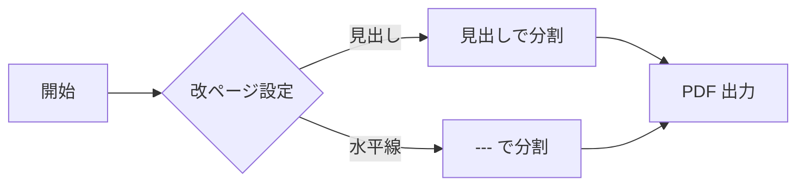

# 印刷サンプル ①（見出し1・1つ目）

このファイルは **設定 ＞ 印刷** の各項目を確認するためのサンプルです。

> **重要**: 改ページは「印刷 / PDF 出力時」にだけ反映されます。画面のスクロール
> プレビューは1本につながった連続表示なので、改ページ線は出ません。確認するには
> ツールバーの **印刷 ⎙** ボタン、またはブラウザの **Ctrl+P**（印刷プレビュー）を
> 開いてください。送信先は「**PDF として保存**」が高速・鮮明でおすすめです。

## 各設定の確認ポイント

- **見出しで改ページ**: 選んだレベルの見出しの **2つ目以降** の前で改ページします
  （最初の1つは改ページしません）。このサンプルは H1 が3つ、H2 が複数あるので、
  「見出し1」なら H1 ②③ の前で、「見出し2」なら各 H2 の2つ目以降の前で分かれます。
- **水平線 (---) で改ページ**: 下の「`---` ここで改ページ」の箇所で分かれます。
- **YAMLヘッダー (front matter) の後で改ページ**: このファイル冒頭の `---` で囲んだ
  メタ情報（title など）が1ページ目に分かれ、本文が次ページから始まります。
- **要素をページ途中で分割しない**: 長いコードブロック・表・画像・図がページ境界で
  泣き別れしなくなります。
- **見出しをページ末尾に単独で残さない**: 見出しだけが行末に取り残されなくなります。
- **リンクの URL を併記**: 下のリンクが `テキスト <https://...>` の形で URL 付きで
  印刷されます。

## 見出し2（A）

H2 が複数あるので「見出し2で改ページ」の効果を確認できます。

### 見出し3（A-1）

H3 も複数用意しています。「見出し3で改ページ」を試せます。

### 見出し3（A-2）

3レベル目の2つ目。

---

# 印刷サンプル ②（見出し1・2つ目）

「見出し1で改ページ」なら、この H1 の前で新しいページになります。

## 見出し2（B）

### 見出し3（B-1）

## 見出し2（C）

長い本文の例です。ここから下に十分な分量のテキストを置くことで、コードブロックや
表がページの境界にかかりやすくなり、「ページ途中で分割しない」設定の効果が分かり
やすくなります。ダミーの文章を続けます。あいうえお、かきくけこ、さしすせそ。
たちつてと、なにぬねの、はひふへほ、まみむめも、やゆよ、らりるれろ、わをん。
あいうえお、かきくけこ、さしすせそ。たちつてと、なにぬねの、はひふへほ。

### リンク（URL併記の確認）

- 外部リンク: [Anthropic](https://www.anthropic.com)
- 外部リンク: [GitHub リポジトリ](https://github.com/lancard-aikawa/fastmd-explorer)
- 内部リンク（URL併記の対象外）: [SAMPLE を開く](SAMPLE.md)

### 表（分割しないの確認）

| 設定                         | 既定 | 効果                                   |
|------------------------------|:----:|----------------------------------------|
| 見出しで改ページ             | 見出し1 | 選択レベルの2つ目以降で改ページ        |
| 水平線 (---) で改ページ       | OFF  | `---` を改ページ位置として扱う          |
| ページ途中で分割しない       | ON   | コード・表・画像・図を割らない          |
| 見出しを行末に残さない       | ON   | 見出し直後で改ページしない              |
| リンクの URL を併記           | OFF  | `テキスト <URL>` 形式で印刷             |

### コードブロック（分割しないの確認）

```js
// 長めのコードブロック。ページ境界にかかると、
// 「ページ途中で分割しない」設定の有無で見え方が変わります。
function pageBreakDemo(items) {
  const result = [];
  for (const item of items) {
    if (!item) continue;
    result.push({
      id: item.id,
      name: item.name ?? '(no name)',
      score: Math.round((item.score ?? 0) * 100) / 100,
    });
  }
  return result.sort((a, b) => b.score - a.score);
}

const sample = [
  { id: 1, name: 'alpha', score: 0.42 },
  { id: 2, name: 'beta',  score: 0.88 },
  { id: 3, name: 'gamma', score: 0.13 },
];
console.log(pageBreakDemo(sample));
```

### 図（分割しないの確認）



`---` ここで改ページ（「水平線で改ページ」が ON のとき）:

---

# 印刷サンプル ③（見出し1・3つ目）

最後のセクションです。「見出し1で改ページ」なら、この H1 の前でも改ページされます。

## 見出し2（D）

お疲れさまでした。印刷プレビュー（Ctrl+P）で各設定の効果を見比べてみてください。🖨️
