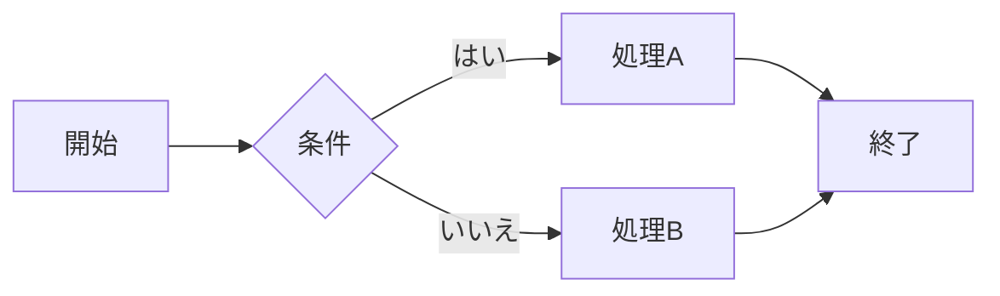
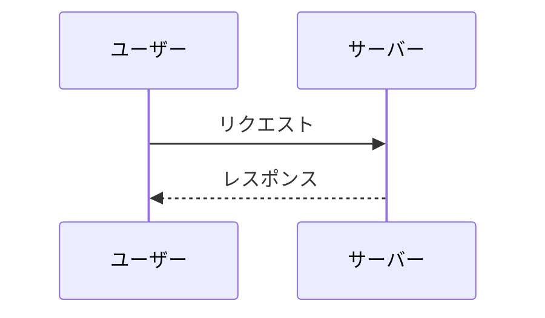

# fastmd-explorer 機能サンプル

このファイルは、fastmd-explorer がレンダリングできる Markdown 記法をひと通り
並べたデモです。プレビューで表示を確認したり、印刷 / PDF 出力の見本にどうぞ。

> 上部の YAML（front matter）は GitHub 風のテーブルとして表示されます。

---

## 見出しとアウトライン

`#`〜`####` の見出しから、右側にアウトライン（目次）が自動生成されます。

### 第3レベルの見出し

#### 第4レベルの見出し

子見出しを持つ項目は `▼ / ▶` で折りたためます。

---

## テキスト装飾

**太字**、*斜体*、~~打ち消し線~~、`インラインコード`、そして
通常の文章を組み合わせられます。

---

## リスト

箇条書き:

- 親項目
  - 子項目
  - 子項目
- 親項目

番号付き:

1. 手順その1
2. 手順その2
3. 手順その3

チェックリスト:

- [x] 完了したタスク
- [ ] 未完了のタスク
- [ ] あとでやる

---

## リンク

- 外部リンク: [Anthropic](https://www.anthropic.com)（別タブで開きます）
- Markdown リンク: [README を開く](README.md)（同じフォルダの `.md` はアプリ内で開きます）
- Wiki リンク: [[SAMPLE]] や [[SAMPLE|このファイル]]（`[[ファイル名]]` 形式）

> リンク先の `.md` が存在すると、クリックでそのファイルが開きます。
> 被参照（バックリンク）はプレビュー上部に一覧表示されます。

---

## 引用

> 引用ブロックです。
>
> 複数行・ネストも可能です。
> > ネストした引用。

---

## テーブル

ヘッダーをクリックすると、その列で並べ替えできます。

| 機能            | 対応 | 補足                         |
|-----------------|:----:|------------------------------|
| 見出し / 目次   |  ✓   | h1〜h4 からアウトライン生成   |
| シンタックス強調 |  ✓   | highlight.js                 |
| Mermaid 図      |  ✓   | ズーム・パン対応             |
| LaTeX 数式      |  ✓   | KaTeX                        |
| リンク図        |  ✓   | Cytoscape.js（🕸 ボタン）     |

---

## コードブロック

各コードブロックの右上に「コピー」ボタンが付きます。

```js
// JavaScript
function greet(name) {
  return `Hello, ${name}!`;
}
console.log(greet("world"));
```

```python
# Python
def fib(n):
    a, b = 0, 1
    for _ in range(n):
        a, b = b, a + b
    return a
```

```bash
# シェル（$HOME などは数式化されません）
echo "$HOME"
git status
```

---

## Mermaid 図

フローチャート（ホイールで拡大縮小、ドラッグで移動できます）:



シーケンス図:



---

## LaTeX 数式

インライン数式は `$...$`、ブロック数式は `$$...$$` で書きます。

- ピタゴラスの定理: $a^2 + b^2 = c^2$
- オイラーの等式: $e^{i\pi} + 1 = 0$
- ギリシャ文字や添字: $\alpha,\ \beta,\ \sum_{k=1}^{n} k = \frac{n(n+1)}{2}$

ブロック（積分・分数）:

$$\int_0^1 x\,dx = \frac{1}{2}$$

行列:

$$
\begin{pmatrix}
1 & 0 \\
0 & 1
\end{pmatrix}
$$

複数行の整列（aligned）:

$$
\begin{aligned}
f(x) &= (x+1)^2 \\
     &= x^2 + 2x + 1
\end{aligned}
$$

---

## その他

水平線（区切り線）:

---

絵文字もそのまま表示されます: 🚀 ✅ 📝 🕸 📑

---

## ヒント（アプリの機能）

- **アウトライン**: 右側パネルから見出しへジャンプ
- **リンク図 🕸**: `.md` 間の相互リンクを力学レイアウトで可視化、ノードクリックで開く・PNG保存
- **全md結合 PDF 📑**: フォルダ内の全 `.md` を1つにまとめて印刷 / PDF 化
- **印刷 ⎙**: 送信先は「PDF として保存」推奨
- **タグ・重要フラグ**: 各ファイルにタグ付け・☆フラグ・メモを付与（`.mdexplorer/tags.json` に保存）
- **全文検索 🔍**: フォルダ内を横断検索

ハッピー Markdown! 🎉
